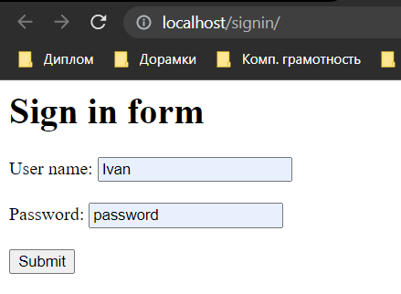
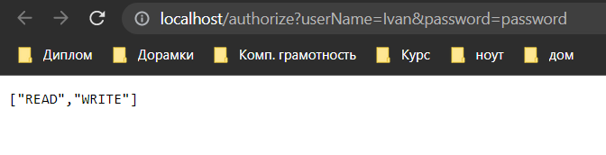

## Задача Прокси на nginx, сервис авторизации

Код по [ссылке](https://github.com/A-Sakhmina/netology_jclo_rest/tree/master/src/main/java/com/sakhmina)

### Описание

Запуск приложения сервиса авторизации на сервере [nginx](https://nginx.org/).
Написана [конфигурация для nginx](nginx_config.txt) так, чтобы он при вызове http://localhost/signin
возвращал нам html-страницу с формой авторизации.

Файл конфигурации находятся на локальном диске по пути`C:/Work/nginx-1.22.0/config`, html-формы(начальная страница `index.html`
и [страница авторизации](signin.html) `/signin/signin.html`) `C:/Work/nginx-1.22.0/html`.

Сервис авторизации пользователей по логину и паролю. Но ключевым в этом задании является то, как приложение будет
реагировать на ошибки, которые наш сервис будет выбрасывать в разных случаях.

В приложении использован:

- механизм обработки исключений в **Spring**(*exception handlers*);
- валидация запросов(annotation `@Valid` , `@Size`, `@NotBlank`);
- **HttpClient** service
- **Postman**
- **nginx** server

#### Пример заполнения формы по адресу http://localhost/signin

#### Ответ сервера nginx на отправленный запрос(заполненную форму)

