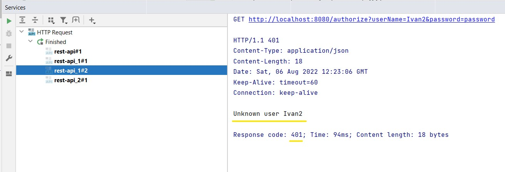
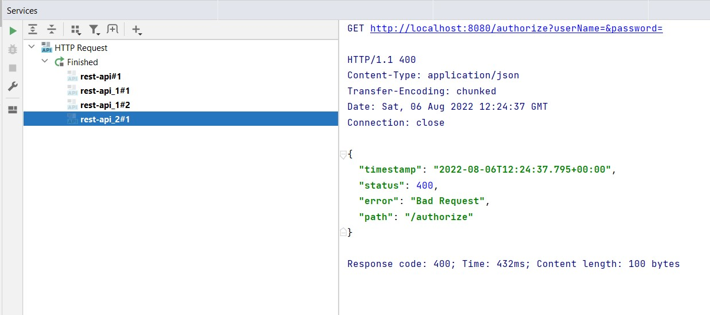

## Задача Сервис авторизации

Код по [ссылке](https://github.com/A-Sakhmina/netology_jclo_rest/tree/master/src/main/java/com/sakhmina)

### Описание

Сервис авторизации пользователей по логину и паролю. Но ключевым в этом задании является то, как приложение будет
реагировать на ошибки, которые наш сервис будет выбрасывать в разных случаях.

В приложении использован:
- механизм обработки исключений в Spring;
- валидация запросов.

### Примеры ответов на запросы

- [Пример 1. Корректный запрос](README.md:18)
- [Пример 2. Обработчик ошибок на UnauthorizedUser](README.md:20)
- [Пример 3. Обработчик ошибок на InvalidCredentials](README.md:22)

#### Пример ответа на запрос через сервис HTTP Client

#### Пример ответа на запрос с неверным именем

#### Пример ответа на запрос с пустым именем или паролем

